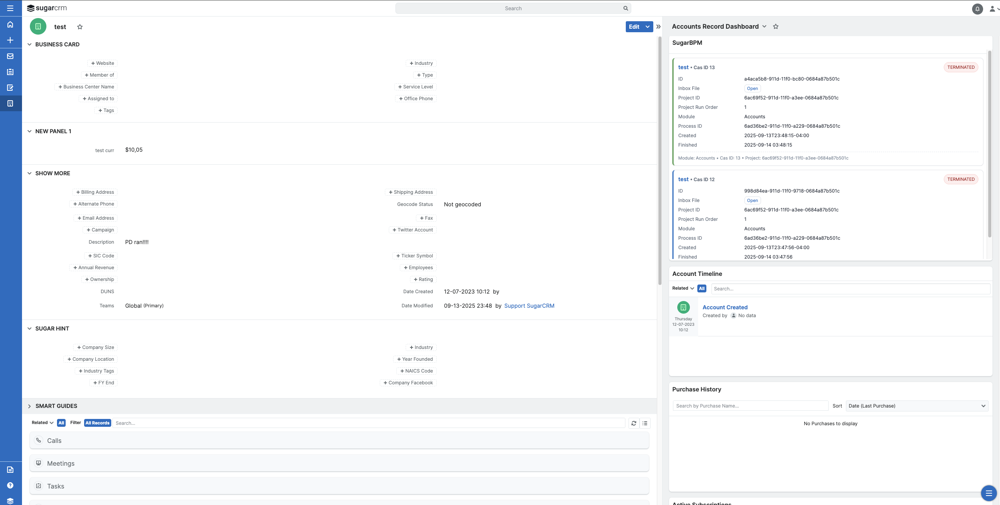
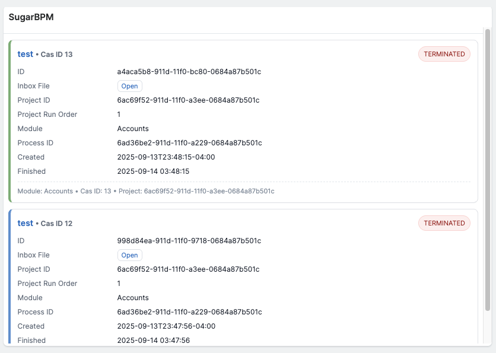

# SugarBPM Dashlet

This is a custom SugarCRM dashlet (`bpmdash`) that displays triggered process definition data from `pmse_Inbox` in a clean, card-based layout.  
It was built as a practical customization project to extend SugarCRM’s functionality.

---

## Features
- Card Layout — Each record is shown as its own card, with alternating accent colors for easy scanning.  
- Consistent Cas ID Labels — All references to case IDs are clearly labeled as Cas ID.  
- Status Pills — Quick visual cues for case status (e.g., IN PROGRESS, TERMINATED).  
- Cas ID Link — Direct link to the inbox file for fast access.  
- Project + Case Metadata — Grid layout for fields like project ID, run order, module, created/finished dates.  
- Dynamic CSS Loader — A custom `CssLoader` plugin automatically loads styles without touching core SugarCRM files.  

---

## File Structure
```
   ├─ custom/
      ├─ clients/base/views/bpmdash/
      │  ├─ bpmdash.hbs
      │  ├─ bpmdash.js
      │  └─ bpmdash.php
      ├─ include/css/bpmdash.css
      ├─ include/javascript/sugar7/plugins/CssLoader.js
      └─ Extension/application/Ext/JSGroupings/addCssLoaderPlugin.php
```

---

## Installation
1. Copy only these files into your instance, **merging into existing folders** (do not overwrite unrelated files):
2. Run Quick Repair and Rebuild from the Admin panel.  
3. Add the SugarBPM dashlet to the record view dashboard.  
4. The dashlet will automatically fetch related triggered process definition data for the record you are viewing.  

---

## Screenshot



---

## Tech Notes
- Data Source: Calls `pmse_Inbox/casesList` via the SugarCRM REST API, filtered by the current record ID.  
- Templating: Uses Sugar’s `.hbs` Handlebars templates.  
- Styling: Inline CSS for the card layout + optional `bpmdash.css`.  
- Plugin System: Registers a custom `CssLoader` plugin to dynamically load stylesheets.  

---

## Learning Purpose
This project demonstrates:
- Extending SugarCRM with custom dashlets.  
- Using the REST API in client-side Sugar code.  
- Applying modern UI/UX concepts inside a legacy platform.  
- Structuring code for maintainability and reuse.  

---

## Connect
- Author: Dustin Coker  
- LinkedIn: [linkedin.com/in/dustin-coker-447870285](https://www.linkedin.com/in/dustin-coker-447870285/)  
- Email: [dustincoker@icloud.com](mailto:dustincoker@icloud.com)  

---

## License
This customization is shared for educational and portfolio purposes.  
Please adapt and extend it responsibly within your SugarCRM environment.
